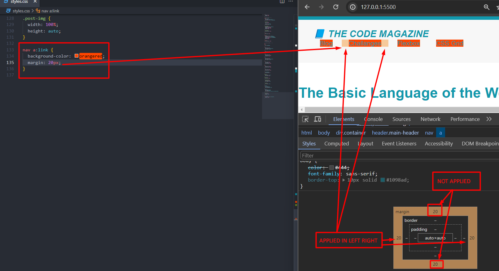
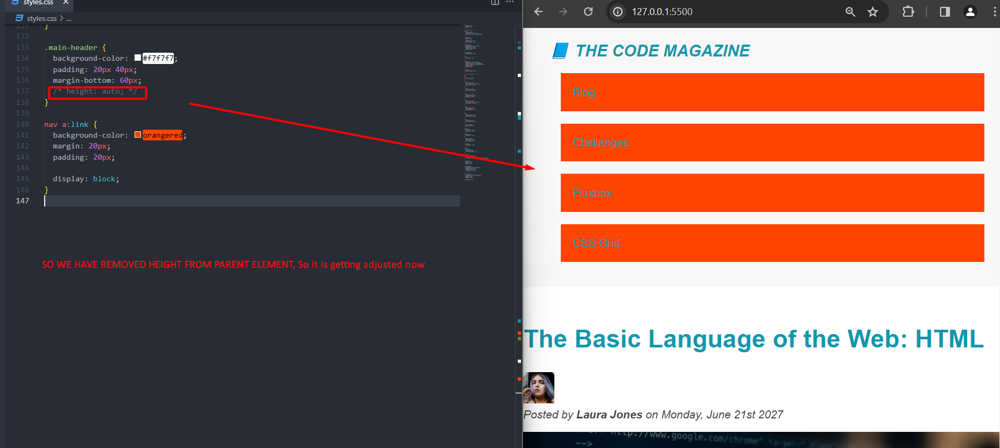

# CSS Fundamentals

## Section Intro (20)

- CSS is all about Styling the content that we write in HTML
- We will learn some theorytical concept of CSS

## Introduction to CSS (21)


## Inline, Internal & External CSS (22)

- There are 3 places wehre we can write CSS, and we call them inline CSS, internal CSS & External CSS

- Let's Learn All :

- In this Lecture We will keep working on the same Project `The Code Magazine`

- So Just copy the same Folder > Paste it with a New Name : **03-CSS-Findaments**

**INLINE CSS** : Inline CSS is basically just writinng the CSS code inside essentially of the element.

```html
<header>
  <!--Inline CSS. It is used with STYLE Property-->
  <h1 style="color: blue">📘 The Code Magazine</h1>

  <nav style="background-color: rgb(178, 151, 203); margin: 10%">
    <a href="./blog.html">Blog</a>
    <a href="#">Challanges</a>
    <a href="#">Flexbox</a>
    <a href="#">CSS Grid</a>
  </nav>
</header>
```

**INTERNAL CSS** : To use Internal CSS, we come here, in the Head, And we declare a Style Element, And we can write our CSS inside the Style element. It also help in Seperation of Concern, unlike inline CSS

```html
<html lng="en">
  <head>
    <meta charset="UTF-8" />
    <title>The Basic Language of the Web : HTML</title>

    <!--Internal CSS : We use Style Element & Inside of it, we declare css rules-->

    <!--So We Start with a Selector, Because our CSS need a way of knowing what element we want to style & Then we write our declaration block-->
    <style>
      h1 {
        color: brown;
        background-color: aqua;
      }
    </style>
  </head>

  <body>
    <header>
      <h1>📘 The Code Magazine</h1>

      <nav>
        <a href="./blog.html">Blog</a>
        <a href="#">Challanges</a>
        <a href="#">Flexbox</a>
        <a href="#">CSS Grid</a>
      </nav>
    </header>
  </body>
</html>
```

**EXTERNAL CSS** : We can seperate things even more by putting all our css code into a special CSS File.

Create A File > `style.css` >

```css
h1 {
  color: brown;
  background-color: aqua;
}
```

```html
<!DOCTYPE html>

<html lng="en">
  <head>
    <meta charset="UTF-8" />
    <title>The Basic Language of the Web : HTML</title>

    <!--For Connecting the External  CSS File, We use Link Element -->
    <!--We use href Attribute for Linking the File & REL attribute to tell HTML that  this a a Style sheet-->
    <link href="./styles.css" rel="stylesheet" />
  </head>

  <body>
    <header>
      <h1>📘 The Code Magazine</h1>

      <nav>
        <a href="./blog.html">Blog</a>
        <a href="#">Challanges</a>
        <a href="#">Flexbox</a>
        <a href="#">CSS Grid</a>
      </nav>
    </header>
  </body>
</html>
```

## Styling Text (23)

```css
/* We will Learn about 6 Properties to style TEXT wth CSS*/

/*As a Recap  : We have a selctor, a Declaration Block, Declaration or Style  and In Each Declaration it has one Property & Value*/
h1 {
  /* 🟢  */
  font-size: 26px;
  /* 🟢 Font Family is used for using different font of text. But the Font should be installed in the Users Computer, else it will not work.*/
  font-family: sans-serif;
  /* 🟢 text Transform to To Tuen The Text Uppercase, Lowercase etc*/
  text-transform: uppercase;
  /* 🟢  Fonr Style : Is used for Italic, normal, oblique, inherit, initial etc*/
  font-style: italic;
  /* 🟢 Font Weight : is a Text Property, is used for making bold, thinner */
  font-weight: bold;
}

h2 {
  font-size: 40px;
  font-family: sans-serif;
}

h3 {
  font-size: 30px;
  font-family: sans-serif;
}

h4 {
  font-size: 20px;
  font-family: sans-serif;
  text-transform: uppercase;

  /* 🟢  Allign Text : For Left , Right, Center Allign*/
  text-align: center;
}

p {
  font-size: 22px;
  font-family: sans-serif;
  /* 🟢  Line Height : Space Between lines*/
  line-height: 1.5;
}

/*We selected all the Li, and not ol & ul. Why? by doing this we can target all the list Element*/

li {
  font-family: sans-serif;
  font-size: 20px;
}

/*If you observe, in the p element, we used strong, em element, but still the style of p is applied in the child element. Because of inheritence*/
```

## Combining Selectors (24)

```css
/* All the CSS Rule has a same Font Family. SO doinng that is repetative and should be in our practice */

/* 🟢 So We can combine the CSS Selectors into One List */
/* 📌  WE CALL IT LIST SELECTOR */
h1,
h2,
h3,
h4,
li,
p {
  font-family: sans-serif;
}

h1 {
  font-size: 26px;

  text-transform: uppercase;
  font-style: italic;
}

h2 {
  font-size: 40px;
}

h3 {
  font-size: 30px;
}

h4 {
  font-size: 20px;
  text-transform: uppercase;

  text-align: center;
}

p {
  font-size: 22px;

  line-height: 1.5;
}

li {
  font-size: 20px;
}

/* Another Way of Combining Selectors */
/* As Footer We Have a P, and We want it to be little small in size */
/* 🟢 📌We will use Desendent Selector */
/* It will select all the P element which is inside the footer */
footer p {
  font-size: 15px;
}

/* Nested Decendent Selector */
article header p {
  font-style: italic;
}
```

## Class & ID Selectors (25)

- At the end of Previous Lecture, we have discussed how nice it would be if we can name some elements & Then use those names to select them in CSS. And we will do this by **Class & IDs**

- The difference between id & class is, ID is Unique and is not allowed to repeat ID, and class can be used multiple times to select multiple element

```html
<header>
  <h2>The Basic Language of the Web: HTML</h2>

  

  <!--We are naming the element with id-->
  <p id="author">
    Posted by <strong>Laura Jones</strong> on Monday, June 21st 2027
  </p>

  
</header>

<!--So here we are using class attribute to select the P Element-->
<!--In CSS, if we have a class or ID name with multiple words, we use - or _ to seperate-->
<aside>
  <h4>Related posts</h4>
  <ul>
    <li>
      
      <a href="#">How to Learn Web Developement</a>
      <p class="related-author">By Jonas Schemedtmann</p>
    </li>
    <li>
      
      <a href="#">The Unknown power of CSS</a>
      <p class="related-author">By Jim Dillon</p>
    </li>
    <li>
      
      <a href="#">Why JavaScript is Awsome</a>
      <p class="related-author">By Matilda</p>
    </li>
  </ul>
</aside>

<footer>
  <!--We are Naming the P Element with a id attribute-->
  <p id="copyright">Copyright &copy; 2027 by The Code Magazine</p>
</footer>
```

CSS

```css
h1,
h2,
h3,
h4,
li,
p {
  font-family: sans-serif;
}

h1 {
  font-size: 26px;

  text-transform: uppercase;
  font-style: italic;
}

h2 {
  font-size: 40px;
}

h3 {
  font-size: 30px;
}

h4 {
  font-size: 20px;
  text-transform: uppercase;

  text-align: center;
}

p {
  font-size: 22px;

  line-height: 1.5;
}

li {
  font-size: 20px;
}

/* footer p {
  font-size: 15px;
} */

/* 
So Nexted Selector We are not using here

article header p {
  font-style: italic;
} */

/* 📌🟢In CSS, we can use #ID to select the particular Element */
/* 📌🟢 ID Selector  */
#author {
  font-style: italic;
  font-size: 18px;
}

#copyright {
  font-size: 16px;
}

/* 📌🟢For The Clsses, We use . (dot) */
/* 🟢📌Class Selector */

.related-author {
  font-size: 18px;

  /* Font Weight : is a Text Property, is used for making bold, thinner */
  font-weight: bold;
}
```

- Now you may think, we have selected p multiple times, then which CSS Rule to be applied?

Answer : Well, All the three rules will be applied in `<p>`

---

Challange : Remove Bulltet Points of the List (Related Post)

```html
<aside>
  <h4>Related posts</h4>
  <ul class="related">
    <li>
      
      <a href="#">How to Learn Web Developement</a>
      <p class="related-author">By Jonas Schemedtmann</p>
    </li>
    <li>
      
      <a href="#">The Unknown power of CSS</a>
      <p class="related-author">By Jim Dillon</p>
    </li>
    <li>
      
      <a href="#">Why JavaScript is Awsome</a>
      <p class="related-author">By Matilda</p>
    </li>
  </ul>
</aside>
```

```css
.related {
  /* List -Style is used to Change the style of List */
  list-style: none;
}
```

WHY WE USED CLASS insted of ID? Even though UL is single here.?

Answer : Well, usually in the real world, we avoid to use ID. ALways use classes for prepare for the future. Imagine, that we used as ID of Related, but then in some point later, somewhere on the page, we wanted to add another list of related posts. Maybe we want it in the Sidebar & Footer. Imagine a complex layout. Then if we would have used ID = related in the beginning, we would not have to go back and change that id to CLASS, so we could now another list.

- SO ALWAYS USE CLASSES.

## Working with Colors (26)


```css
/* Learn about Color Property */

h1,
h2,
h3,
h4,
li,
p {
  font-family: sans-serif;
  color: #444;
}

/* Using List Selector */
/* Overriding the Color of h1, h2, & h3*/
h1,
h2,
h3 {
  /* 🟢📌Color: To gove the content color */
  color: #1098ad;
}

.main-header {
  /* 🟢📌Background Color */
  background-color: #f7f7f7;
}

/* Adding Borderin the Related Post */
/* We are using Element Selector, when we use Element name to select */
aside {
  background-color: #f7f7f7;
  /* 🟢🟢 Border : , it accepts multiple property : Width, Style, Color */
  /* It is a short hand property : Because we use one property to define 3 different kind of properties */

  /* 🟢🟢 */
  /* border: 5px solid #1098ad; */

  /* We also have some special type of border property */
  border-top: 5px solid #1098ad;
  border-bottom: 5px solid #1098ad;
}

/* For Giving whole webpage a Background Color */
body {
  background-color: blueviolet;
}
```

## Pseudo-Classes (27)

- Pseudo-Class sounds very strange, but it is very straight forward.

- Let's Style the First List Element different from the other one.

- So the Easy way is to add a CLASS in the List Element, and then in CSS, we select it and do some styling

```css
/* 

FOR NOOB PEOPLE 

.first-list {
  font-weight: bold;
} */

/* Instead of doing it Manually, CSS has automatic way to figure it out which is the First List Element of a Container */

/* So we start by selecting LI, which will basically select all the LI element, then we write a psedu class by writing : like this */

/* The FIRST-CHILD Psedo class does is tht it will select an li element or actually it will select all the  li element, that are first child element of its parent element */
li:first-child {
  font-weight: bold;
}

/* So the Li Element is the Last Child of its Parent Element */
li:last-child {
  font-style: italic;
}

/* To Target a Specific Elemet */
/* Here we use nth-child and a paranthesis will take which number */
li:nth-child(2) {
  color: red;
}

/* We can also write keyword in the Paranthesis */
li:nth-child(odd) {
  font-family: Cambria, Cochin, Georgia, Times, "Times New Roman", serif;
}

/* Let's Discuss about some common misconception around preudo classes

Lets think of we want to select the first paragraph element that is inside of the Article :

*/

article p:first-child {
  color: red;

  /* But if you see in webpage, you will find, nothing happened 😭😭
  
  Why it did not work?
  Because CSS will do is to select a P element, which is actually the first child of the article. But Currently, articles First Child is Header. 
  Article
    - header
    - p
    - p
    - h3
    - p
    - p
    - p
  Article
  
  */
}

/* It is working as p is the last child of Article */
article p:last-child {
  text-transform: uppercase;
}

/* Conclusion 

When we mix multiple elements inside of a parent element, then these pseudo classes do not work really well.
They are however perfect for situation like, when all the child elements are same. In a element OL, UL, all the Child Element is supposed to be the same, So there it will work perfectly

*/
```

## Styling Hyperlinks (28)

In this Lecture, we will learn How to Style Hyperlinks with the help of Pseudo Classes:

```css
/* Styling Links */

/* This is not a Good Practice */
/* a {
  color: #1098ad;
} */

/* Instead we should style a Pseudo class of the anchor, because that will allow us to target different state */

/* 1. Link Pseudo Class. Basically this will target all the anchor elements that have an href attribute */
a:link {
  color: #1098ad;

  /* Text Property to add decoration  */
  text-decoration: none;
}

/* 2. Visited Pseudo Class */

a:visited {
  /* color: #444; */
  color: #1098ad;
}

/* 3. Hover */
a:hover {
  color: orangered;
  font-weight: bold;

  /* Text Decoration : we can use it with short hand : Line, Style, Color */
  text-decoration: underline wavy olivedrab;
}

/* State of Clicking */
a:active {
  background-color: #444;
  font-style: italic;
}

/* These Four State must be defined in the same exact order

Link > Visited > Hover > Active (LVHA)
*/
```

## Using Chrome DevTools (29)

- User Agent Style Sheet - Is Default Style
- Click on any element, and see in the Style Tab (all css rulesappliend on it)
- .hvr : We can force state of the element
- We can add/Delete/Modify any declarartion in it


## CSS Theory #1: Conflicts Between Selectors (30)


```html
<footer>
  <p id="copyright" class="copyright text">
    Copyright &copy; 2027 by The Code Magazine
  </p>
</footer>
```

```css
/* Resolving Conflict */
/* So in out Footrt P, We have one id, 2 class */

/*Also if you hover on the Selector, you will get*/

#copyright {
  color: red;
  /* 🥇 ID will win */
}

.copyright {
  color: blue;
}

.text {
  color: yellow;
}

footer p {
  color: green;
}
```


ALSO VS CODE HELPS US TO RESOLVE CONFLICT BY SHOWING SELECTOR SPECIFICITY


---

```css
a:link,
a:visited {
  color: #1098ad;
  text-decoration: none;
}

a:hover {
  color: orangered;
  font-weight: bold;

  text-decoration: underline wavy olivedrab;
}

a:active {
  background-color: #444;
  font-style: italic;
}

a {
  /* It will not work, as the Priority is More in Pseduo Class than Element Selector */
  color: black;
}
```

- TO work with Important Declaration : Though it should be the last resort

```css
#copyright {
  color: red;
  /* 🥇 ID will win */
}

.copyright {
  color: blue;
}

.text {
  color: yellow;
}

footer p {
  color: green !important;
  /* It will work now */
}
```

## CSS Theory #2: Inheritence and the Universal Selectors (31)

- Let's now learn about inheritence.

- We already saw inheritence in action before

```html
<p id="author">
  Posted by <strong>Laura Jones</strong> on Monday, June 21st 2027
</p>
```

- Laura Jones, which is a strong element, still gets the style of paragraph element inside of which it is located.


- Basically, inheritence is a mechanism by which some styles, so some properties get their values inherited fron parent element to child element.

---

```css
/* We are using to set some style into body element,for inheritence, because body element is the parent element of all the other element in our HTML document */
/* Though not all property get inherited, it is mostly about the ones that are about text */
body {
  color: red;
}

h1,
h2,
h3,
h4,
li,
p {
  font-family: sans-serif;

  /* Inherited Style is Easily Overridden whenever there is any rule that applies for the same property */
  /* Inherited Properties are the one who has lowset priority */
  color: #444;
}

h1,
h2,
h3 {
  color: #1098ad;
}
```

- In the above example, Red will not work in all text, as it is overridden.. If I want it to work, we need to remove the overriding lines

```css
/* We are using to set some style into body element,for inheritence, because body element is the parent element of all the other element in our HTML document */
/* Though not all property get inherited, it is mostly about the ones that are about text */
body {
  color: red;
}

h1,
h2,
h3,
h4,
li,
p {
  font-family: sans-serif;

  /* Removed Overriding */
  /* color: #444; */
}

h1,
h2,
h3 {
  color: #1098ad;
}
```

```css
/* So this is really elements inheriting values for certain properties from one another. So this is not conflicting selectors. This Body Selectors is not selecting all of its elements.It does not apply to all of the elemens. Instead what we do is to declare values for these properties here such as color and font family, and then they simply get passed down to all the child elements that are contained within the body. That is wht we put these declararion relating to text into the body */

body {
  color: #444;
  font-family: sans-serif;
}

/* h1,
h2,
h3,
h4,
li,
p {
  
   color: #444; 
} */

h1,
h2,
h3 {
  color: #1098ad;
}
```

- Many style actually not get inherited, because that would be very impractical for most of the properties.

```css
/* Many Properties are not inherited */

body {
  color: #444;
  font-family: sans-serif;

  /* Non heriting properties */
  /* It simply added a border in the top of the Body Element🌍🌍, but it did not do so in all of the child element. Beacuse that would be very very impractical */
  border-top: 10px solid #1098ad;
}

/* h1,
h2,
h3,
h4,
li,
p {
  
   color: #444; 
} */

h1,
h2,
h3 {
  color: #1098ad;
}
```


---

- Inheritence also works in much smalled scale which is somethinthat we do also all the time.
- So inheritience is not only helpful by putting style into the body, but also in other situations.

- Lets say we want to chnage the style of these 4 Links (In NAV)

```css
nav a:link {
  font-size: 18px;
}
```

- Now lets say we have onr Paragraph and Links both inside Nav

```html
<nav>
  <p>This is Navigation</p>
  <a href="./blog.html">Blog</a>
  <a href="#">Challanges</a>
  <a href="#">Flexbox</a>
  <a href="#">CSS Grid</a>
</nav>
```

- But Currently All the Paragraph is having 22px in Size, SO how we can chnage only this particular P's Size?

- By Inheritence :

```css
/* nav a:link,
nav p {
  font-size: 18px;
} */

/* or */

nav {
  font-size: 40px;
}
```

- Universal Selector

```css
/* Another way to adding some styles to all of the element */
/* Universal Selector */
/* It selcets all the elements on the Page, This is very useful if we want certain property to be applied to all element but which does not get inherited  */
/* This selector has lowset priority */
* {
  border-top: 12px solid #1098ad;
}
```

#### So the difference between universal selector & body selector :

- Universal selector simply applies to all the elements, and there is no inheritence involved. And therefore, this is perfect if you want to apply a certain property that does not automatically get inherited to all the elements.

- On the other hand, any style we put in body, gets inherited.

## CHALLANGE #1 (32)


---

```html
<!DOCTYPE html>
<html lang="en">
  <head>
    <meta charset="UTF-8" />
    <meta name="viewport" content="width=device-width, initial-scale=1.0" />
    <title>Document</title>
    <link rel="stylesheet" href="./style1.css" />
  </head>
  <body>
    <article class="product">
      <h2 class="product-title">Converse Chuck Taylor All Star Low Top</h2>
      

      <p class="price"><strong>$65.00</strong></p>
      <p class="shipping">Free Shipping</p>
      <p>
        Ready to dress up or down these classic canvas chucks are an everyday
        wardrobe staple
      </p>

      <a class="more-info" href="https://www.converse.in/" target="_blank"
        >More information &rarr;</a
      >

      <h3 class="details-title">Product details</h3>

      <ul class="details-list">
        <li>Leightweight, durable canvas sneaker</li>
        <li>Lightly padded footbed for added comfort</li>
        <li>Iconic Chuck Taylor ankle patch</li>
      </ul>

      <button class="add-btn">Add to cart</button>
    </article>
  </body>
</html>
```

#### TIPS :

- We used body where we want to inherit the styles in child element
- We used class selector, and no Element Selector
- We used Pseudu Class in Button & Links, but with Class

```css
body {
  /* For inherited */
  font-family: sans-serif;
  line-height: 1.4;
}

/* PRODUCT */
.product {
  border: 5px solid black;
}

.product-title {
  background-color: #f7f7f7;
  text-transform: uppercase;
  text-align: center;
  font-size: 22px;
}

/* PRODUCT INFORMATION */
.price {
  font-size: 24px;
}

.shipping {
  color: #777;
  font-weight: bold;
  text-transform: uppercase;
  font-size: 12px;
}

/* MORE INFO */
.more-info:link,
.more-info:visited {
  color: black;
}
.more-info:hover,
.more-info:active {
  text-decoration: none;
}

/* PRODUCT DETAILS */

.details-title {
  text-transform: uppercase;
  font-style: 16px;
}

.details-list {
  list-style: square;
}

/* Button */
.add-btn {
  background-color: black;
  color: #f7f7f7;
  border: none;
  font-size: 20px;
  text-transform: uppercase;
  cursor: pointer;
}

.add-btn:hover {
  background-color: white;
  color: black;
  border: none;
  font-weight: bold;
}
```

## CSS Theory #3 : The CSS Box Model (33)

- Box Model Defines how Element is displayed on a webpage & How they are sized

- In Box Model, each and Every element on the Webpage can be seen as a Rectengular Box, and Each of these baxes can have coontent, birder, Padding, Margin, Fill Area


## Using Margins and Paddings (34)

- In this video, we will apply the box model in practice, and in particular margins & paddings.

- One of the freat candidate of padding is the Header element here which has this background color. So an element ehich has some backgrounnd color can always use some padding in order to dreate some space between the content and the outside of an element.

- Remember padding is the space which is inside of the element. So the element here is header

- Margin is space between two elements

- Also we have learned collapsing margin. So suppose, we have two elelemnt, h3 & p

p has margin-bottom 15px & h3 has margin-top 40px. So altogether, we get 15+40=55px. But it is not happeiniing, instead only 40px is margin


---

### Colapsing Margin : So basically when we have two margins that occupy the same space, only one of them is actually visible on this page. And that is basically the larger of the two.

---

- We also learned, Big Box, Container should be added at the TOP, followed by smaller one

```css
/* We will reset all the Margins & padding before doing anythin, so that we can design bettwe 

We will use univesal selector, instead of body, because we want this margin & Padding applied for all element, instead of inheritence. As we all know css rules releted to Text are mostly inherited


This practice is bery common and used in many places. Then we can override the padding and margin later
*/
* {
  margin: 0px;
  padding: 0px;
}

body {
  color: #444;
  font-family: sans-serif;
  border-top: 10px solid #1098ad;
}

/* We usually use the big boxes tipin the stylesheet, so that the boxes which has multiple child element
should be put in top */
.main-header {
  background-color: #f7f7f7;
  /* padding: 20px;
  padding-left: 40px;
  padding-right: 40px; */
  /* short Hand : TopButton LeftRight */
  padding: 20px 40px;
  /* It is very common to use space at the bottom in order to create vertical space */
  /* It makes most sense to add mergin botton then any ather margin for vertical space */
  margin-bottom: 60px;
}

.post-header {
  margin-bottom: 40px;
}

nav {
  font-size: 18px;
}

aside {
  background-color: #f7f7f7;

  border-top: 5px solid #1098ad;
  border-bottom: 5px solid #1098ad;
  /* padding-top: 50px;
  padding-bottom: 50px; */

  padding: 50px 0;
}

article {
  margin-bottom: 50px;
}

h1,
h2,
h3 {
  color: #1098ad;
}

h1 {
  font-size: 26px;
  text-transform: uppercase;
  font-style: italic;
}

h2 {
  font-size: 40px;
  margin-bottom: 30px;
}

h3 {
  font-size: 30px;
  margin-bottom: 20px;
  margin-top: 40px;
}

h4 {
  font-size: 20px;
  text-transform: uppercase;
  text-align: center;
}

p {
  font-size: 22px;
  line-height: 1.5;
  /* Adding space between each paragraph element */
  margin-bottom: 15px;
}

ul,
ol {
  margin-left: 50px;
  margin-bottom: 20px;
}

/* Margin : Space between two elements */
li {
  font-size: 20px;
  margin-bottom: 10px;
}

/* We do not want this to be in Last List Element */
li:last-child {
  margin-bottom: 0;
}

#author {
  font-style: italic;
  font-size: 18px;
}

#copyright {
  font-size: 16px;
}

.related-author {
  font-size: 18px;
  font-weight: bold;
}

.related {
  list-style: none;
}

li:first-child {
  font-weight: bold;
}

/* So the Li Element is the Last Child of its Parent Element */
li:last-child {
  font-style: italic;
}

/* To Target a Specific Elemet */
/* Here we use nth-child and a paranthesis will take which number */
/* li:nth-child(2) {
  color: red;
} */

/* Styling Links */

a:link,
a:visited {
  color: #1098ad;
  text-decoration: none;
}

a:hover {
  color: orangered;
  font-weight: bold;

  text-decoration: underline wavy olivedrab;
}
```

#### RECAP : When You need some space inside of an element, which is very useful mostly when there is a background color or border on the element, then you always use padding.

#### On the Other hand, in order to create space outside of the element, also to create space between multiple elements, always use margin

#### Incase to add space vertically, then add margin-bottom

---

## Adding Dimensions (35)

- Lets also learn how we can add dimension to elements in CSS using the height & widht property


So Total Dimension(Height/Width) = border + Padding + height/width

```css
.main-header {
  background-color: #f7f7f7;
  padding: 20px 40px;
  margin-bottom: 60px;

  /* 🟢🟢🟢 */
  height: 80px;
}

aside {
  background-color: #f7f7f7;
  border-top: 5px solid #1098ad;
  border-bottom: 5px solid #1098ad;
  /* padding-top: 50px;
  padding-bottom: 50px; */
  padding: 50px 0;
  /* 🟢🟢🟢 */
  width: 500px;
}

/* 🟢🟢🟢 */
.post-img {
  /* Most of the time we do not specify image size in HTML, instead we specify in CSS 
  
  Also whatever we write in HTML, it would be overridden by CSS*/

  /* If we use % instead of px, this % is usually the % of the width of the parent container. So the parent of the post image is the header, and the header is basically the entire width of the page
  
  So if you change the size of the window, the size of image would be automatically adjusted with the size of the parent container. So we can choose any % of size of the parent container. Say 50%, 80%, 100% any thing
  
  This is very impotacnt when start working for resposnive website. The Website that adapt to the screen width*/
  width: 100%;

  /* This will fix the aspect ratio */
  /* This specifying the height and setting it auto is only necessary if that height is already specified before in HTML
  
  
  If we do not use HTML height/width, then if we add CSS height, then the other one (Height/width) would get automatically adjusted*/
  height: auto;
}
```

## Centering Our Page (36)

- We need to put all of the element into a container element, if we do not do that, then what is there actually to center in the window.

```html
<body>
  <div class="container">
    <header>....</header>
    <article>....</article>
    <aside>....</aside>
    <footer>....</footer>
  </div>
</body>
```

```css
.container {
  /* So all the child element can not be bigger than that 700px */
  /* So the Child Element can never be wider than parent element. So all the child element will be 700px */
  width: 800px;

  /* So we need to add margin after that */
  /* So the margin in the left needs to same as margin to the right side, and they should be calculated automatically by the browser. So this means the right & left margin would be exactly of the same size. As a result, the container will look certered inside the body element */
  margin-left: auto;
  margin-right: auto;

  /* We can also use shorthand */
  /* margin: 0 auto; */
}
```

## Challange #2 (37)


```css
/* 1. Global Reset : To every single element on the page */
* {
  margin: 0;
  padding: 0;
}

body {
  /* For inherited */
  font-family: sans-serif;
  line-height: 1.4;
}

/* PRODUCT */
.product {
  border: 5px solid black;
  /* 2. Make the Widht (It is working as a container */
  width: 825px;
  /* 3. For centering this in the browser. So after creating a container (Product here), we cernter it in the body : So : We have used margin */
  margin: 50px auto;
}

.product-title {
  background-color: #f7f7f7;
  text-transform: uppercase;
  text-align: center;
  font-size: 30px;
  /* 4. For making the adjustment inside the element  */
  padding: 15px;
}

/* PRODUCT INFORMATION */
.price {
  font-size: 24px;
}

.shipping {
  color: #777;
  font-weight: bold;
  text-transform: uppercase;
  font-size: 12px;
  /* 5. For vertical Gap between elements vertically */
  margin-bottom: 20px;
}

/* MORE INFO */

.more-info:link,
.more-info:visited {
  color: black;
}
.more-info:hover,
.more-info:active {
  text-decoration: none;
}

/* PRODUCT DETAILS */

.details-title {
  text-transform: uppercase;
  font-style: 16px;
  /* 6. Margin added */
  margin-bottom: 15px;
  margin-top: 15px;
}

.details-list {
  /* 7. Added left margin for bullet point */
  margin-left: 20px;
}

.details-list li {
  /* 8. Adding space between */
  margin-bottom: 15px;
}

/* Button */
.add-btn {
  background-color: black;
  color: #f7f7f7;
  border: none;
  font-size: 20px;
  text-transform: uppercase;
  cursor: pointer;

  /* 9. Space Between Elemenet */
  padding: 15px;
  width: 100%;
  border-top: 5px solid black;
}

.add-btn:hover {
  background-color: white;
  color: black;
}
```

## CSS Theory #4: Types of Boxes (38)


- Lets work with the Links we have in the anchor element (inline) in the Nav Element

- We have added some margin, but it is applied horizontally only. (on Left & Right Side)

- What did not happen was that vertical space was created. So the Top & Bottom margin remians unchanged.

- If you see in the developer tool, it will still appear, but in reality the top & bottom not applied.

- The Reason for that, the anchor element is an inline element, where the box model does not create any vertical space. And also same is true for padding




- So we have chnaged the Display from inline to block, but due the height of parent element, that we fixed SOMEWHERE, so it is going out of the Header.

- So lets remove the fixed height from parent element



- We have experimented with P & Li. So we chnaged their display setting from block to inline and check all the change

```css
li {
  font-size: 20px;
  margin-bottom: 10px;
  display: inline;
}

p {
  font-size: 22px;
  line-height: 1.5;
  margin-bottom: 15px;
  display: inline;
}
```


```css
/* Inline Block Element - Example : 

We can use best of Block & Inline
So it occupies content's space & and cause no line-break
but
Also we can use height, weight, margin, padding like block level */

nav a:link {
  /* background-color: aquamarine;
  margin: 20px;
  padding: 20px;
  display: block; */

  margin-right: 30px; /*Will work in Inline as well*/
  margin-top: 10px; /*Will NOT work in Inline 😭 */

  /* To make it work we use inline block */
  display: inline-block;
}

/* We also used two pseudo class one with another */
nav a:link:last-child {
  margin-right: 0;
}
```

IMAGES ARE INLINED BLOCK ELEMENT

```css
/* IMPORTANT : 
1. Images are inline blocked element by default as it does not create line breaks & and occupy only its own place
2. As it accepts height, width, margin, padding 
*/
.post-img {
  width: 100%;
  height: auto;
  margin: 100px;
  padding: 50px;
}
```

---

CONCLUSION of Type of Boxes:

- Most of the time we actually leave the display settings alone and simply use the predefined box type, because by default, they do actually make a lot of sense

- However we can use display set to block, in order to make a small inline element , for example, occupy an entire line, which is something what we will sometimes need in the real world

- And also sometimes, we do not need a block level element, to push all the other elelemnts into a new line. So basically we do not want them to occupy all the blank space available to fill. And in that case, we can set them to inline element, or probably more useful, we can set them to an inline block element

---

## CSS Theory #5: Absolute Positioning (39)


- Example : We will create a Like button, which is set outside of the container (Bottom Right)

- This Like button always stays in the position. So it is not impacted any of the surrounding elements. No matter what happpens, to the rest of the page. This is the great example of Absolutely Positioned elements


- So We need to put the Like Button in the Body, Anywhere for now, as it does not matter

```html
<body>
  <div class="container">
    <header>....</header>
    <article>....</article>
    <aside>....</aside>
    <footer>....</footer>
    <button>💓 Like</button>
  </div>
</body>
```

```css
button {
  font-size: 20px;
  padding: 10px;
  cursor: pointer;

  /* Positioning */
  /* Now this element is completely taken out of the flow */
  /* These 50 Pixel need to be in relation to something. And By default, these pixel are relation to viewport, The Visible part of the page in the Browser*/
  position: absolute;
  top: 50px;
  left: 50px;
}
```

- But however usually we do not want this.
- Usually we absolutely position the element in relation to other parent element. And in order to do that, we need to specifially set the position of that element to relative.

- So we want in this case, this element should be in relation with page, and not the view port.

```css
body {
  color: #444;
  font-family: sans-serif;
  border-top: 10px solid #1098ad;
  position: relative;
}

button {
  font-size: 20px;
  padding: 10px;
  cursor: pointer;

  position: absolute;
  bottom: 50px;
  right: 50px;
}
```

- We can also put it inside the container (For Experiment). And in order to do that, we have to put the button element inside the CONTAINER Element (Parent). So it does not matter where you put the button element, but it should be inside anywhere in the CONTAINER ELEMENT

```css
.container {
  width: 800px;

  margin-left: auto;
  margin-right: auto;
  position: relative;
}

button {
  font-size: 20px;
  padding: 10px;
  cursor: pointer;

  position: absolute;
  bottom: 50px;
  right: 50px;
}
```


## Pseudo-Elements (40)

- Psedu Element are essential element, that do not exist in HTML, but we can still select & style in CSS.

- Example : first letter of a Paragraph, or first line of a Pragaraph, or some other text ofourse

```css
h1 {
  font-size: 26px;
  text-transform: uppercase;
  font-style: italic;
}

/* Psedu Classes are written with one colon & psedu elemnet is written with two colon */
h1::first-letter {
  font-style: normal;
  margin-right: 10px;
}
```


---

```css
h2 {
  font-size: 40px;
  margin-bottom: 30px;
}

h2::first-letter {
  font-size: 80px;
  margin-right: -10px;
}
```

- So, basically, we selected this pseduo element, which again not actually an element in the HTML, but it is as if it was an element that we can select and then style right here

- ANOTHER EXAMPLE : First Line

```css
p {
  font-size: 22px;
  line-height: 1.5;
  margin-bottom: 15px;
  /* display: inline; */
}

p::first-line {
  color: red;
}
```

---

- **Another New Selector : Adjacent Element Selector, or Adjacent Sibling Selector**.

- So Sibling element is an element that is part of the same parent.

- So the Adjacent Sibling is very next to the Element. So the Adjacent Element of this h3 is p here. So basically adjacent element is the sibling that comes right after it

```html
<h3>What is HTML?</h3>

<p>
  HTML stands for <strong>H</strong>yper<strong>T</strong>ext
  <strong>M</strong>arkup <strong>L</strong>anguage. It's a markup language that
  web developers use to structure and describe the content of a webpage (not a
  programming language).
</p>
```

```css
/* So we want to select only the paragraph that comes after h3s. */
/* So it will select only the paragraphs that are immediately after h3s, and then in there only the first line is actually selected and styles */
h3 + p::first-line {
  color: red;
}
```

---

- **Now we will learn, the most used pseudu element, which is `after & before` pseudo elements**

- So the after pseudo element, creates a pseudo element that will automatically be the very child of the selected element

```css
h2 {
  font-size: 40px;
  margin-bottom: 30px;
  /* For visibility I adddedBackground, Later will change it */
  background-color: #444;
  position: relative;
}

/* So for any cosmetic element, we no need to add Elements in HTML, but can add in CSS */

h2::after {
  /* We need to mention the content property */
  content: "TOP";
  background-color: #ffe70e;
  font-size: 16px;
  font-weight: bold;

  /* By default, any pseudo element is actually an inline element, so if we want to add padding, we want the box model to apply to it normally */

  display: inline-block;
  padding: 5px 10px;

  position: absolute;
  top: -15px;
  right: -25px;
}
```


- We can use `::before` or `::after` in pseudo element

- Basically the difference, is, after makes the last child of the parent element & before makes the first child of element of the parent element

- Though we are using the pseudo element in absolute way, it does not matter whether we have used it as after or before

---

## Developer Skill #1 : Googling and Reading Documentation (41)

- Do not memorize all the things you learn in this CSS course. It is okay to not to know everything

- You can always read from google/documentation

- In this lecture, we will learn how to search stuff that I do not know &how to read documentation.

---

Example :

- Google : CSS property to add a mouse cursor to button
- Go for stack overflow, css-tricks, or mozilla.org (All are good)
- Check the Most Voter Answer in stack overflow

---

- Google : CSS how to center anchor elements
- Stack overflow : Set the text-alignment property in the centre in Parent Element

```css
nav a:link {
  margin-right: 30px; /*Will work in Inline as well*/
  margin-top: 10px; /*Will NOT work in Inline 😭 */

  /* To make it work we use inline block */
  display: inline-block;

  /* Text Allign wont work */
  /* text-align: center; */
}

/* So in Parent we need to add text alignment */

nav {
  font-size: 18px;
  text-align: center;
}
```

- So when we have to center bunch of elemnt, no matter it is inline or inline-block elements, then all we need to do is to add a text aligned center property on the parent element. So text allign work in block element/table cell block by default

---

- We want to know more about the property, we can go for mdn documentation.

- Google : mdn css text align
- Google : mdn css border

---

## Developer Skill #2 : Debugging and Asking Questions (42)

HTML :

- Most of the time, we miss some closing tag in HTML. So try to see the part

- **Also, we can take help of HTML VALIDATOR TOOL** : So we usually use validator.w3.org

- **Another Tool : Diff Checker** : it is tool we use for to compare one code with other

---

CSS :

1.  Most of the CSS Issue is due to conflict between selector

- So we can take help of Inspect > Style Dev Tool

- Also, if two selector is there, but many times, the selector with more complex one that gets applied. So keep the selector simple for avoiding conflict.

- Also we can use Selector Specificity(By hovering). But higher the number, the more that selector will apply

---

2. Another common reason is to mispel class or property name

- Inspeact & check out what is happened here in dev tools

- **Also use Style is Dev tool and chnage/twick the data so that you understand anything in real time, instead chnageing in CSS file**

---

3. Third, many beginner do not link CSS file correctly

---

## CHALLANGE #3 (43)


---

```html
<div class="colors">
  <div class="color color-black"></div>
  <div class="color color-blue"></div>
  <div class="color color-red"></div>
  <div class="color color-yellow"></div>
  <div class="color color-green"></div>
  <div class="color color-brown"></div>
</div>
```

```css
* {
  margin: 0;
  padding: 0;
}

body {
  /* For inherited */
  font-family: sans-serif;
  line-height: 1.4;
}

/* PRODUCT */
.product {
  border: 5px solid black;
  width: 825px;

  margin: 50px auto;
  position: relative;
}

/* 1. Adding Before Pseudo Elements 🆕🆕 */
.product::before {
  content: "sale";
  font-weight: bold;
  text-transform: uppercase;
  background-color: #ec2f2f;
  padding: 7px 15px;
  font-size: 15px;
  /* text-align: center; */
  color: #f7f7f7;
  /* Letter Spacing 🆕🆕 Learnt */
  letter-spacing: 2px;

  position: absolute;
  top: -20px;
  left: -35px;
}

.product-title {
  background-color: #f7f7f7;
  text-transform: uppercase;
  text-align: center;
  font-size: 30px;
  padding: 15px;
}

/* PRODUCT INFORMATION */
.price {
  font-size: 24px;
}

.shipping {
  color: #777;
  font-weight: bold;
  text-transform: uppercase;
  font-size: 12px;
  margin-bottom: 20px;
}

/* MORE INFO */

.more-info:link,
.more-info:visited {
  color: black;

  /* 🆕🆕Anchor Element is an inline block, so top & bottom margin will not work, so we are chnaging it to inline-block */
  display: inline-block;
  margin-bottom: 30px;
}
.more-info:hover,
.more-info:active {
  text-decoration: none;
}

.color {
  height: 22px;
  width: 22px;

  /* 🆕🆕We can not use inline, then height & width will not work,, So we are going with inline block */
  display: inline-block;
  margin-right: 5px;
}

.color-black {
  background-color: black;
}
.color-blue {
  background-color: blue;
}
.color-red {
  background-color: red;
}

.color-yellow {
  background-color: yellow;
}

.color-green {
  background-color: green;
}

.color-brown {
  background-color: brown;
}
/* PRODUCT DETAILS */

.details-title {
  text-transform: uppercase;
  font-style: 16px;
  margin-bottom: 15px;
  margin-top: 15px;
}

.details-list {
  margin-left: 20px;
}

.details-list li {
  margin-bottom: 15px;
}

/* Button */
.add-btn {
  background-color: black;
  color: #f7f7f7;
  border: none;
  font-size: 20px;
  text-transform: uppercase;
  cursor: pointer;

  padding: 15px;
  width: 100%;
  border-top: 5px solid black;
}

.add-btn:hover {
  background-color: white;
  color: black;
}
```

## WHAT I LEARNT?

1. Conflict between selectors
2. Inheritence
3. Box Model
   1. Margin, Padding, Height, Width, Border
4. Type of Box :
   1. Display : block, inline, inline-block
5. Position : Relative(Parent), Absolute with top, bottom, left, right

---

Extra :

- If inline block we are using, the height & Width will not work, and margin top & bottom also
- We can use multiple class name in a single class attribute for better selecting & selecting differently
- Inline-block is best suited almost everywhere

---
